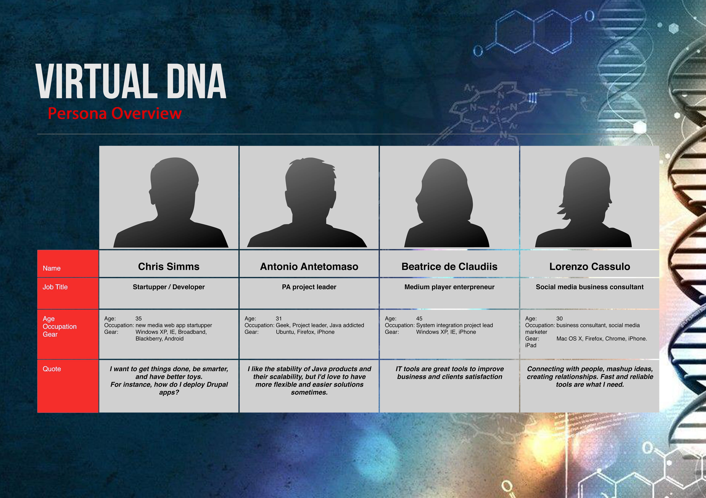

# **Virtual DNA** Application
__Discover more about your culture, history and identity.__
Virtual DNA allows registered users to upload a picture from a url, the application 
will connect to the Clarifai API to retrieve data prediction about the uploaded picture.

## Problem to solve
The only way to discover more about your ethnic origin is to buy a DNA-kit test, which is most of the time very expansive. Once you buy the kit you will wait for it, usually you have to wait a lot of time also for the results.

* DNA test kit are too expansive
* Too much time before getting the results

### What is **Clarifai**? 
Clarifai is an artificial intelligence company that excels in visual recognition, solving real-world problems for businesses.

## Target Audience
Primary target will be young professionals that wants to learn more about themselves, or just having fun, generally man and woman from 25 years old to 35.
 

## Project Specifications
This Web Application is build with:
- **React** 
- **NodeJS** 
- **Express** 

#### Dev:
- **cors**
- **body-parser**

#### Security:
- **bcrypt** 

#### Database:
- **Postgres**

## Folder Structure
```
my-app/
  README.md
  node_modules/
  package.json
  public/
    index.html
    favicon.ico
  src/
    App.css
    App.js
    App.test.js
    index.css
    index.js
    logo.svg
```

For the project, **these files must exist with exact filenames**:

* `public/index.html` is the page template;
* `src/index.js` is the JavaScript entry point.


## Technical Specifications:
- __What data will you need to store? How will it be organized? Describe each
table, its columns, and its relationships with other tables.__

- **Data organization**
```
     Table 'Users'
```

This will be a list of all of the users stored in the database.

The columns will be:
- UserId (each user will be assigned a unique Id with a serial primary key)
- Name (name of the user)
- Email (email of the user)
- Password (password of the user)
- Score (numbers of image upload)


|   UserId   |        Name       |          Email              |      Score     |
|------------|:-----------------:|----------------------------:|:--------------:|
|     1      |           Luca    |            luca@gmail.com   |         4      |
|     2      |       Stephany    |          steph@mgmail.com   |        10      |
|     3      |           Trin    |          trin@hotmail.com   |         8      |


- __What does your product look like? List each view, their purpose, and how they work__

The information on each user will include the id, name, email and password. After the user has submitted the url will be detecteded more information such as gender, age and multicultural appearance.

## **ROUTES**
Virtual DNA will be __highly accessible__ and incredibly __user friendly__, the
website will have the following routes:

#### Homepage('/')
This will be the first page the user sees.

#### Sign In('/signin')
This page allows users to sign in their own account.

#### Register('/register')
This page allows a user to register an account. (Ideally one account for one user);

#### Update Score('/image')
This route will update the rank of the user +1 after the image will be analized.

## **Milestones, Timeline**
The application it's almost complete. Most of the front end is't set up and 
working, it's connected already with the server.

#### Sunday 28th 
- Implementing Postgres database 
- Creating the table Users
- Changing background and text color 

#### Monday 29th
- Connecting the database with the front-end
- Register a user
- Getting User profile 

#### Tuesday 30th 
- Update entries 
- Test sign in 
- Test Application
- Deploy with Heroku 

